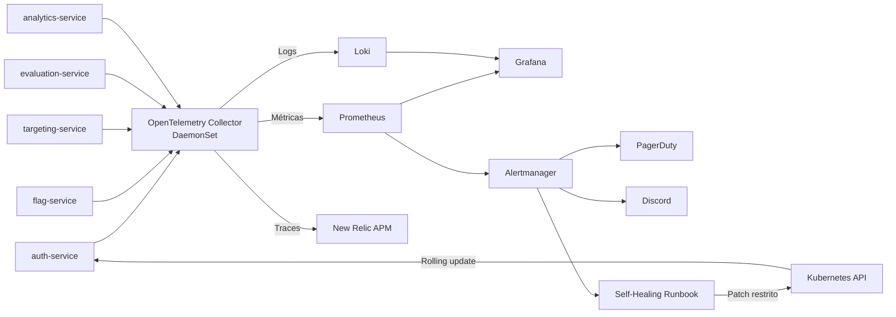

# ToggleMaster — Tech Challenge FIAP | Fase 4

Plataforma distribuída para gerenciamento e avaliação de feature flags, executada no Amazon EKS e evoluída, na Fase 4, com uma camada completa de **observabilidade, gestão de incidentes e resposta ativa**.

A solução integra métricas, logs, traces distribuídos, alertas, ChatOps, gerenciamento de incidentes e Self-Healing utilizando Prometheus, Grafana, Loki, OpenTelemetry, New Relic, Alertmanager, PagerDuty e Discord.

## Fase atual

**Fase 4 — Observabilidade Total e Resposta Ativa**

A entrega utiliza como base as fases anteriores do Tech Challenge:

- Microsserviços conteinerizados.
- Infraestrutura provisionada com Terraform.
- Cluster Kubernetes no Amazon EKS.
- Imagens armazenadas no Amazon ECR.
- CI/CD com GitHub Actions e práticas de DevSecOps.
- GitOps utilizando Argo CD.
- Segredos armazenados no AWS Secrets Manager.
- External Secrets Operator.
- Escalonamento com HPA e KEDA.

## Objetivo da Fase 4

A Fase 4 adiciona ao ToggleMaster os seguintes recursos:

- Monitoramento de infraestrutura e aplicações.
- Dashboards customizados.
- Centralização de logs.
- Padronização da telemetria com OpenTelemetry.
- Distributed Tracing e APM comercial.
- Alertas inteligentes baseados em métricas.
- Integração com PagerDuty.
- ChatOps pelo Discord.
- Self-Healing com permissões Kubernetes restritas.
- Scripts de validação reproduzíveis.

## Microsserviços

| Serviço | Responsabilidade |
| --- | --- |
| `auth-service` | Autenticação e gerenciamento de API keys |
| `flag-service` | Cadastro e gerenciamento das feature flags |
| `targeting-service` | Regras de segmentação e targeting |
| `evaluation-service` | Orquestração e avaliação das feature flags |
| `analytics-service` | Processamento assíncrono de eventos por meio do Amazon SQS |

## Arquitetura da solução



## Fluxo de telemetria

Os microsserviços enviam dados utilizando OTLP para o OpenTelemetry Collector:

```text
Microsserviços instrumentados
        |
        | OTLP gRPC :4317
        v
OpenTelemetry Collector
        |
        +--> Métricas --> Prometheus --> Grafana
        |
        +--> Logs ------> Loki -------> Grafana Explore
        |
        +--> Traces ----> New Relic APM
```

O Collector é executado como um `DaemonSet`, garantindo um agente por node do cluster.

Estado saudável esperado:

```text
DESIRED=3
CURRENT=3
READY=3
AVAILABLE=3
```

Uma `PriorityClass` dedicada garante que o Collector tenha prioridade de agendamento mesmo quando o cluster estiver sob pressão de capacidade:

```text
togglemaster-observability-critical
```

## Stack de observabilidade

| Componente | Responsabilidade |
| --- | --- |
| Prometheus | Coleta, armazenamento e consulta de métricas |
| Grafana | Dashboards e investigação operacional |
| Loki | Centralização e consulta de logs |
| OpenTelemetry Collector | Recepção, processamento e exportação da telemetria |
| New Relic | APM, distributed tracing, spans e mapa de dependências |
| Alertmanager | Agrupamento e roteamento de alertas |
| PagerDuty | Gerenciamento do ciclo de vida dos incidentes |
| Discord | ChatOps e comunicação dos estados FIRING e RESOLVED |
| Self-Healing Runbook | Recuperação automática e controlada do `auth-service` |
| KEDA | Escalonamento do `analytics-service` com base na fila SQS |
| External Secrets Operator | Sincronização de segredos do AWS Secrets Manager |

## Dashboard do Grafana

O dashboard customizado do ToggleMaster centraliza:

- Saúde dos componentes.
- Consumo de CPU e memória.
- Estado dos Pods.
- Taxa de requisições.
- Taxa de erros.
- Informações dos microsserviços.
- Consulta de logs centralizados.

Os manifests e dashboards estão versionados em:

```text
observability/gitops/
```

## Centralização de logs com Loki

O Loki recebe logs encaminhados pelo OpenTelemetry Collector e permite consultas por labels Kubernetes, como:

```text
service_name
k8s_namespace_name
k8s_pod_name
k8s_container_name
```

Exemplo de consulta LogQL:

```logql
{service_name="auth-service"}
```

Exemplo para os sinais sintéticos:

```logql
{service_name="telemetrygen"}
```

## Distributed Tracing com New Relic

O New Relic recebe traces por OTLP HTTP exportados pelo OpenTelemetry Collector.

A instrumentação permite observar:

- Entrada de requisições.
- Chamadas entre microsserviços.
- Latência de cada span.
- Propagação de contexto.
- Erros.
- Dependências entre serviços.
- Processamento assíncrono.

O mapa observado no New Relic apresenta o `evaluation-service` conectado aos serviços:

```text
evaluation-service
├── analytics-service
├── targeting-service
└── flag-service
```

## KEDA e processamento assíncrono

O `analytics-service` utiliza KEDA para escalar de acordo com a quantidade de mensagens na fila SQS.

Recursos envolvidos:

```text
ScaledObject
TriggerAuthentication
HorizontalPodAutoscaler
```

Estado saudável esperado:

```text
ScaledObject Ready=True
HPA keda-hpa-analytics-service criado
```

O estado `Active=False` é normal quando não existem mensagens suficientes na fila para solicitar novas réplicas.

## Alertas

A regra principal monitora respostas HTTP 5xx do `auth-service`.

Critérios utilizados:

| Parâmetro | Valor |
| --- | --- |
| Serviço | `auth-service` |
| Taxa de erro | HTTP 5xx superior a 5% |
| Volume mínimo | 20 requisições |
| Duração | 2 minutos |
| Severidade | `critical` |
| Categoria | `availability` |
| Self-Healing | `true` |

Labels relevantes:

```yaml
severity: critical
category: availability
service: auth-service
self_healing: "true"
```

## PagerDuty e Discord

O Alertmanager encaminha o mesmo alerta crítico para:

- PagerDuty.
- Discord.
- Self-Healing Runbook.

No PagerDuty, o incidente pode percorrer o ciclo:

```text
Triggered
Acknowledged
Resolved
```

No Discord, as mensagens mantêm o histórico dos estados:

```text
FIRING
RESOLVED
```

## Self-Healing

O Self-Healing é realizado por um runbook interno que recebe um webhook do Alertmanager.

Antes de executar qualquer ação, o runbook valida:

```text
status=firing
service=auth-service
self_healing=true
```

Quando o alerta é elegível, o runbook adiciona a anotação:

```text
togglemaster.io/self-healed-at
```

A alteração no template do Pod provoca um novo rolling update do Deployment `auth-service`.

### Segurança do runbook

O runbook utiliza:

- ServiceAccount próprio.
- Role Kubernetes restrita.
- RoleBinding dedicado.
- Permissão apenas para `get` e `patch`.
- Acesso limitado ao Deployment `auth-service`.

O runbook não possui permissão ampla para alterar outros Deployments ou recursos do cluster.

## Falha controlada

O `auth-service` possui uma rota interna utilizada apenas para demonstrar a falha:

```text
/internal/demo/failure
```

Ela somente retorna HTTP 500 quando:

```text
ENABLE_FAILURE_INJECTION=true
```

E a requisição inclui o header:

```text
X-ToggleMaster-Failure-Test
```

Fora da demonstração, a configuração permanece:

```text
ENABLE_FAILURE_INJECTION=false
```

## Fluxo do incidente

```text
1. Falha controlada no auth-service
2. Respostas HTTP 500 são geradas
3. PrometheusRule identifica a taxa de erros
4. Alerta entra em estado FIRING
5. Alertmanager recebe o alerta
6. PagerDuty cria o incidente
7. Discord recebe a notificação
8. Runbook recebe o webhook
9. Runbook aplica patch no auth-service
10. Kubernetes inicia um novo rollout
11. Novo Pod fica Running/Ready
12. Falha permanece desabilitada
13. Alerta entra em estado RESOLVED
```

## Estrutura principal do repositório

```text
.
├── analytics-service/
├── auth-service/
├── evaluation-service/
├── flag-service/
├── targeting-service/
├── infra/
├── observability/
│   └── gitops/
├── scripts/
├── Makefile
└── README.md
```

## GitOps

A observabilidade é provisionada por Applications do Argo CD.

Principais manifests:

| Arquivo | Finalidade |
| --- | --- |
| `monitoring-application.yaml` | Prometheus, Alertmanager, Grafana e exporters |
| `loki-application.yaml` | Loki e componentes relacionados |
| `otel-collector-application.yaml` | OpenTelemetry Collector |
| `otel-priority-class.yaml` | Prioridade de agendamento do Collector |
| `togglemaster-dashboard-configmap.yaml` | Dashboard customizado |
| `togglemaster-alert-rules.yaml` | Regras de alerta |
| `togglemaster-alertmanager-config.yaml` | Rotas para PagerDuty, Discord e runbook |
| `self-healing-runbook.yaml` | Deployment, Service, ServiceAccount e RBAC do runbook |

## Comandos de validação

### Validar os manifests de observabilidade

```bash
make validate-observability
```

### Validar as regras de alerta

```bash
make validate-alert-rules
```

### Validar o OpenTelemetry Collector

```bash
make validate-otel-runtime
```

Resultado esperado:

```text
Desired:   3
Ready:     3
Available: 3
Priority:  togglemaster-observability-critical

Collector disponível em todos os nós.
PriorityClass validada.
Validação concluída.
```

No ambiente acadêmico, nodes sem vagas adicionais são apresentados como aviso, sem invalidar a disponibilidade do Collector.

Para aplicar uma validação estrita de capacidade:

```bash
STRICT_NODE_CAPACITY=true make validate-otel-runtime
```

## Gerar telemetria

```bash
make telemetry-demo
```

O comando:

- Executa fluxos funcionais entre os microsserviços.
- Cria API key.
- Cria feature flag.
- Cria regra de targeting.
- Executa avaliações.
- Gera traces.
- Gera métricas.
- Gera logs.
- Envia os três sinais ao OpenTelemetry Collector.

Consultas sugeridas:

```text
Loki:       {service_name="telemetrygen"}
Prometheus: otelcol_receiver_accepted_spans
New Relic:  procurar pelo serviço telemetrygen
```

## Demonstrar notificações

```bash
make notification-demo
```

O target valida de forma controlada:

```text
FIRING
RESOLVED
```

E permite obter evidências no:

- Discord.
- PagerDuty.

## Executar o incidente real

```bash
make incident-demo
```

O comando:

1. Habilita a falha controlada.
2. Gera respostas HTTP 500.
3. Aguarda o alerta.
4. Aciona o Alertmanager.
5. Aciona PagerDuty e Discord.
6. Aciona o runbook.
7. Solicita um novo rollout.
8. Aguarda a recuperação do serviço.

## Validar o Self-Healing

Após o incidente:

```bash
make self-healing-evidence
```

Resultado esperado:

```text
deployment_restart_requested
self-healed-at
Deployment 1/1
Pod Running/Ready
ENABLE_FAILURE_INJECTION=false
SELF-HEALING VALIDADO DE PONTA A PONTA
```

## External Secrets

Os dados sensíveis são armazenados no AWS Secrets Manager e sincronizados pelo External Secrets Operator.

Entre os segredos utilizados estão:

- Credenciais do Grafana.
- Chave de ingestão do New Relic.
- Integração do PagerDuty.
- Webhook do Discord.
- Credenciais dos microsserviços.

Nenhum valor sensível deve ser salvo no Git.

## Renovação das credenciais do AWS Academy

As credenciais do AWS Academy são temporárias.

Após renovar a sessão do laboratório:

```bash
export AWS_ACCESS_KEY_ID='NOVA_ACCESS_KEY'
export AWS_SECRET_ACCESS_KEY='NOVA_SECRET_KEY'
export AWS_SESSION_TOKEN='NOVO_SESSION_TOKEN'
export AWS_REGION='us-east-1'

make refresh-aws-session
```

O comando atualiza:

- GitHub Actions Secrets.
- `external-secrets/aws-credentials`.
- `analytics-service/aws-credentials`.
- External Secrets Operator.
- ExternalSecrets dos microsserviços.
- Credenciais utilizadas pelo KEDA.
- Estado das Applications do Argo CD.

As credenciais são recebidas por variáveis de ambiente e não são gravadas no repositório.

## Considerações para produção

O ambiente acadêmico utiliza credenciais temporárias fornecidas pelo AWS Academy.

Em produção, a recomendação é substituir as credenciais estáticas por:

- EKS Pod Identity; ou
- IRSA/OIDC.

Nesse modelo, o ServiceAccount recebe credenciais temporárias e rotacionadas automaticamente pela AWS, sem necessidade de armazenar Access Key, Secret Key e Session Token em Secrets Kubernetes.

Também são recomendados para produção:

- Maior capacidade de Pods por node.
- Prefix Delegation configurado de forma adequada.
- Mais capacidade no node group.
- PodDisruptionBudgets.
- Alta disponibilidade dos componentes críticos.
- Políticas de retenção de métricas e logs.
- TLS nos endpoints.
- Network Policies.
- Ajustes de intervalos e agrupamentos do Alertmanager.

## Evidências da Fase 4

A entrega contém as seguintes evidências:

1. Dashboard customizado no Grafana.
2. Logs centralizados no Loki.
3. OpenTelemetry Collector disponível em todos os nodes.
4. Trace distribuído detalhado no New Relic.
5. Service Map com as dependências dos microsserviços.
6. Mensagens FIRING e RESOLVED no Discord.
7. Incidente e timeline no PagerDuty.
8. Self-Healing validado de ponta a ponta.

## Segurança

- Segredos armazenados no AWS Secrets Manager.
- External Secrets Operator para sincronização.
- Nenhuma credencial versionada.
- RBAC de menor privilégio para o runbook.
- Falha controlada protegida por configuração e header.
- GitOps para rastreabilidade e rollback.
- PriorityClass dedicada aos agentes de observabilidade.

## Tecnologias

- AWS
- Amazon EKS
- Amazon ECR
- Amazon SQS
- AWS Secrets Manager
- Terraform
- Kubernetes
- Helm
- Argo CD
- GitHub Actions
- Docker
- Prometheus
- Grafana
- Loki
- OpenTelemetry
- New Relic
- Alertmanager
- PagerDuty
- Discord
- KEDA
- External Secrets Operator
- Go
- Python

## Integrantes

| Nome | RM |
| --- | --- |
| Yuri José do Carmo | rm370037 |
| Diego Felipe Rocha Silva | rm369588 |
| Jhousyfran Muniz Costa | rm369476 |
| Erick Saraiva de Sousa | rm369969 |
| Regis Teruo Nomi | rm369601 |

## Repositório

```text
https://github.com/yurijcarmo/tech-challenge-4
```

## Conclusão

A Fase 4 adiciona ao ToggleMaster uma camada integrada de observabilidade e resposta ativa.

A solução monitora métricas, centraliza logs, registra traces distribuídos, detecta falhas, cria incidentes, comunica o time e executa uma ação corretiva automática e rastreável no Kubernetes.

Os manifests GitOps e os scripts disponibilizados no repositório permitem reproduzir as validações de telemetria, alertas, notificações, incidentes e Self-Healing em um ambiente com acesso ao cluster.
